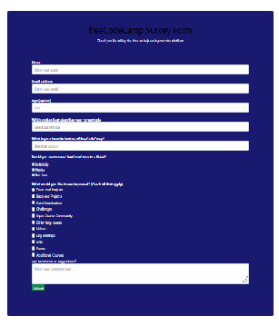

#This is SurveyFormReview Project
    This is simple survey form.Which has some text boxes, Drop down menu, radio-buttons and a submit button.

  ## Built With

- Html,CSS
- Git, Github
- Visual Studio Code

## Getting Started

**This is an example of how you may create simple form with text boxes,dropdown etc**

##Prerequisites

Create repository
Clone it local device using git
Add files , commit and push them to github
Run linters 
Deploy to resolve errors

